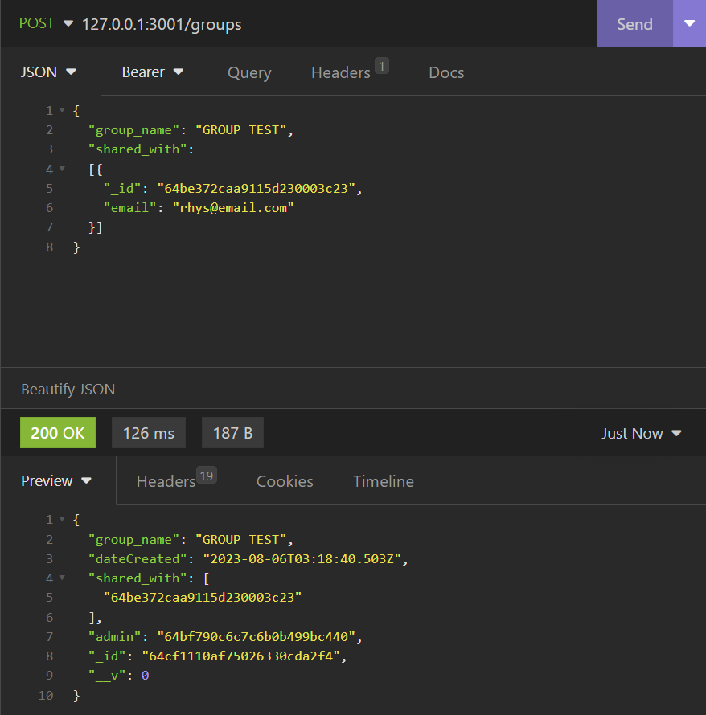
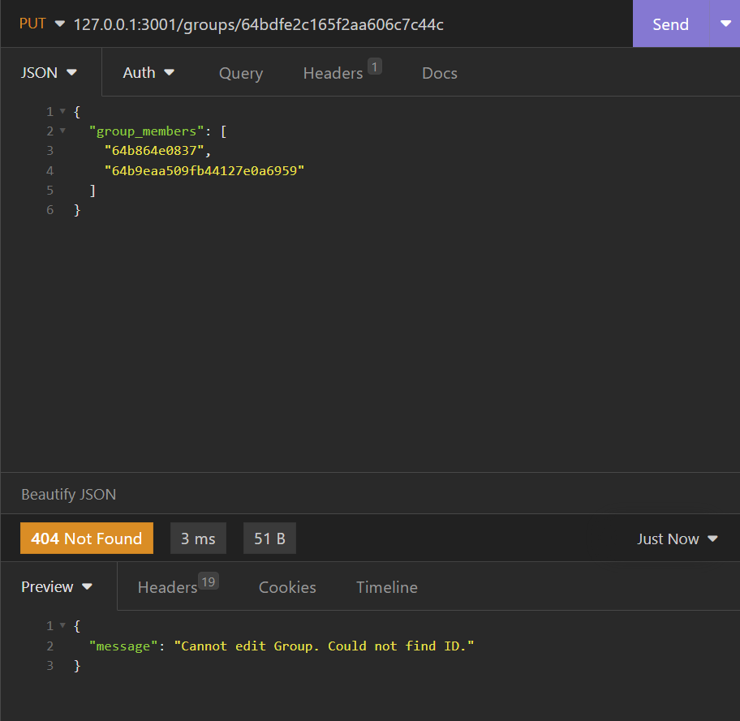
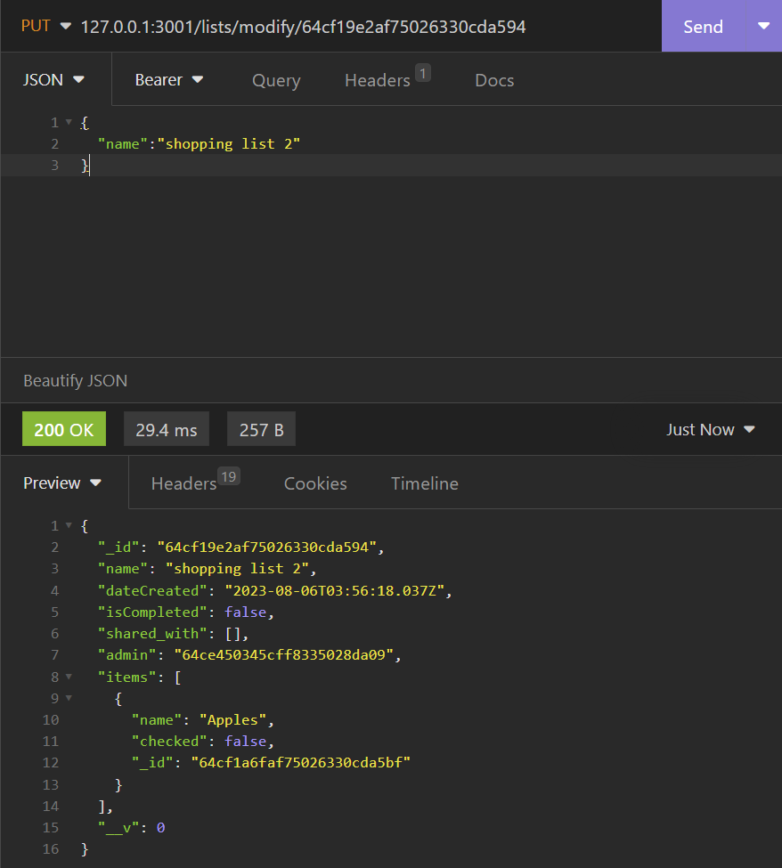
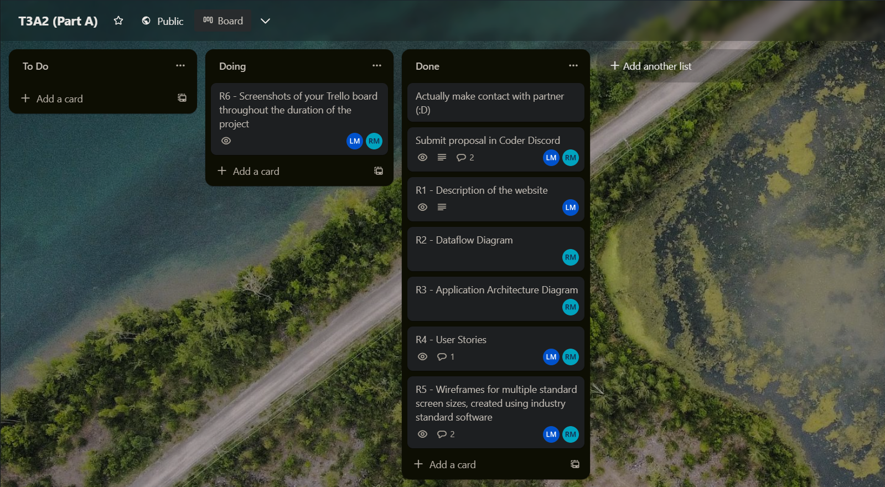

# **PART B DOCUMENTATION**

## Links

All repositories:

https://github.com/Final-Full-Stack-Project-Team

Deployment link:

https://sage-churros-00fcd2.netlify.app/

# **Testing the backend**	

There are 4x collections in the database. The collections are:
- groups
- lists
- users

The screenshots below show testing for all CRUD functionality of the backend.

All CRUD operations for all collections are not possible without user authentication using tokens. This ensures that users are only receiving their own data, and not other users data   
When an request unsuccessful due to invalid token:

When an request is successful with a valid token:

## Users Collection

### User Sign up

User sign up requires the name field to contain a name without being left empty, the email address to meet requirements (cannot contain spaces, must contain '@' and '.') and the password to meet requirements (contain at least 8 characters, a capital letter, and a number)

When name is blank:

When email contains a space, does not contain a '@', '.' or is blank:

When password does not contain at least 8 characters, a capital letter, and a number:

When signup is successful:

### User Login

User login requires correct username and password. 

When logging in with incorrect credentials:

When logging in successfully it returns the user token which is used for authentication:

### GET users

GET all users:

GET user with id:

When getting user with invalid ID:

When getting user with a valid ID:

## Groups Collection

Groups are for the purpose of easily sharing lists with users. This means that if a user wants to frequently share lists with the same people, they do not need to enter their email address each time as those people will reside in the existing group that the user has created. When creating a group, the group name and at least one member is required.
Getting data requires the user to be logged in and authentication is processed using their login token 

### POST Group

When group name is left blank, has a single white space or multiple white spaces:

When group members is left blank:

A Group creator is also made the admin automatically. Only the admin can delete the group. 
When creating a group successfully:

### GET Groups

GET all Groups:

GET user with id:

When getting user with invalid ID:

When getting user with a valid ID:

### PUT Groups

A group's name and its members can be edited.
A group's name cannot be edited to be blank or contain only white spaces. A group cannot be edited to contain no members as a group must have at least one member. A group's name can be changed without the need to change its members. A group's members can be changed without the need to change the its name. And both the group's name and its members can be changed in the same request.

When group ID cannot be found:

When changing a group's name to be empty or only contains a single white space or multiple white spaces:

When editing a group's name is successful:

When editing a group's members with a group member that is not found:

When editing a group's members and not having at least one group member:

When editing group members is successful:

When editing both a group's name and its members are successful:

### DELETE Groups

A single group can be deleted with a group ID, or all groups can be deleted.

When attempting to delete a group with an invalid ID:

When deleting a single group is successful:

When deleting all groups, a successful deletion responds with information about how many groups were deleted.

When there are no groups to delete:

When there was only 1 group to delete:

When there were multiple groups to delete:

## Lists Collection
### POST list

Lists require a name and an admin.

When name is blank:

When there is no admin:

When POST list is successful:

### GET all lists

Whilst lists have their own collection, items do not. Any item added to a list is stored in that the list document with its own ID. This means that users can add whatever items they want to their list and items are not being duplicated in the database.

If items were stored in their own collection, this would mean that if there are 1,000 users who add an item called "Apples", then there would be an items collection which has 1,000 different documents with the same name and different ID which would not be and efficient way to manage database storage. 

With this method, a new ID is created for each apple but they are being added to the list document that already exists and any item that resides in a list is deleted from the when a user deletes the list.

Getting all lists returns the following:

- User ID
- List name
- Date created
- isCompleted
- list admin
- the items that are in the list

### GET list

Get list returns the same thing.

When get list is unsuccessful:

When get list is successful:

### UPDATE list

A list can have its name updated and the items within the list added or removed

When name is blank:

When name change is successful:

When list is not found:

When changing items is successful:

### DELETE list

Only one list can be deleted at a time.

When delete list is unsuccessful:

When delete list is successful:

## User testing

In total, 5 users tested the app. All of them had the same feedback.

They advised that they were able to create an account and log in successfully.

They were all able to make lists, add items to the list, make groups, add people to the groups and successfully share their lists. 

The 2 major points of feedback was:

- Upon entering the app, a message displays saying "loading lists" which made it look like the app was not working. The app looked like this:

- All users showed confusion when clicking the share button on a list as it looked like this:

They advised that when the app says "loading lists" it looks like it isn't working properly. This was caused by logic that was implemented to show a message that says "loading lists" while the app is reaching the backend. And while this logic worked, it only worked when a user was logged in. When a user is logged out, it would display this message all the time. 

The solution was include logic that said if the user is logged in, then display the everything in the app but if the user is logged out then display a new component that instructs the user to log in. The final result looks like this when the user first enters the app:

The second issue was present because each user did not know that they had to create a group in order to share a list. This meant that the users were creating a list a clicking the share button, only to be greeted with a page that has no groups to share the list with and there was no information about what to do.

So the solution to this problem was to create logic that either shows groups if they are present, or show instructions to the user if no groups have been created.

The final result looks like this:

Screenshots of all users who tested the app from the users collection:

 
 
 
 
 
 
 
 
 

# **PART A DOCUMENTATION**
# **R1**
## Description of your website, including: Purpose, Functionality / features, Target audience, Tech stack

### Purpose:
The purpose of the app is to provide users with an effective and easy-to-use solution for sharing and collaborating on lists. Lists are used for many varying applications such as a grocery list, a to-do list, a travel itinerary, a to-do list and more. This app aims to streamline the process of creating, sharing, and managing lists among multiple users with ease. It aims to have a clean UI and UX that makes sense without a steep learning curve so the user can efficiently use the list right away.

### Functionality / Features:

The app aims to have the following features. Although during development, things may change:

- User signup using bcrypt for passwords.

- User sign in page with password reset option.

- Once a user successfully signs up for an account they can create shared groups and add people to them via email. Groups are an optional feature which is useful for users who frequently share lists with the same people. A user can also invite people directly via email without the need to create a group.

- Users can create, read, update and delete new lists.

- Once a list is no longer needed it can be marked as completed.
There will be a "completed" section of the app where completed lists can be read, marked as active, or be deleted.

- All people with access to a list can add items and cross them off the list with a checkbox.

- Crossing items off the list adds a line through the text and ticks the checkbox for easy visual confirmation.

- User accounts, user groups, lists and list items are stored in individual MongoDB collections.

- Multiple users can collaborate on the same list simultaneously, adding items, crossing out completed tasks, and making real-time updates. This feature promotes teamwork and ensures everyone stays on the same page, literally.

### Target Audience:
The app's target audience is any individual or group of people who frequently need to create and manage shared lists. It caters to users of all ages and technical backgrounds, aiming to provide a user-friendly experience for both tech-savvy individuals and those less familiar with technology.

### Tech Stack:
The app utilizes a modern tech stack to deliver a seamless and responsive user experience:

Front-end: HTML, CSS, JavaScript, React.js
 
Back-end: Node.js, Express.js
 
Database: MongoDB
 
Hosting: Netlify, MongoDB Atlas
 
Authentication: JWT (JSON Web Tokens)

# **R2**	
## Data Flow Diagrams

# **R3**	
## Application Architecture Diagram

# **R4**	
## User Stories

1. As an active business person, I want to be able to quickly create lists when I'm on the go and share them with my colleagues so we can keep track of deadlines and prioritize tasks while collaborating efficiently.

2. As a student, I want to be able to share lists with my cohorts so that we can  work together on upcoming group assignments and check off the list as they are completed in order to stay up-to-date on what tasks are ahead of us.

3. As a parent, I want to be able to create weekly grocery lists that can be easily edited while at the supermarket as my grocery needs frequently change. I want to share this list with my partner so they can add items to the list that I may have forgotten.

4. As a traveling salesperson I want to be able to create a list of clients and be able to mark them as completed or crossed out so that I can keep track of the clients who I have visited on any given day.

5. As a person who is not highly tech savvy, I would like to be able to create to-do lists in an app that is simple to use so that I can focus on my tasks without getting overwhelmed by complex user interfaces.

6. As a camping enthusiast, I want to make an inventory of all of my camping gear so that I can check that I have everything I need before heading off to my next camping adventure. After my camping trip has finished, I want to be able to quickly uncheck all items on the list so that I can go through the list again for future trips. I want to be able to easily edit and delete items when I buy or replace things.

# **R5**	
## Wireframes for multiple standard screen sizes, created using industry standard software

The below working file contains wireframes/designs for mobile, tablet and desktop. In the mobile design, the relationship between each page is outlined. The relationships displayed in the mobile version and the same for the tablet and desktop versions.

Please click the below link to view the Figma file:

https://www.figma.com/file/Ef1YxeoB6ynW9VCMY6zRdx/T3A2?type=design&node-id=0%3A1&mode=design&t=bNSu0Xi3jqdfKIgB-1

# **R6**	
## Screenshots of your Trello board throughout the duration of the project

Due to some initial external challenges with successfully being assigned a partner, we first made contact with each other several days after our cohort's partners were assigned. Once we were assigned, we quickly gained contact on Discord, decided what project we would build and agreed to meet via a Discord call on the 31st of June. 

During the call, we created our Trello board and its tasks then assigned tasks to each other which gave us a good direction heading forward. We also created a repository on GitHub for Part A. After our first meeting, our Trello board looked like this:

During the process of working through the work required, we kept in frequent contact via Discord to kept each other updated. We shared this Readme.md document on GitHub and were able to both update it and use git pull requests to receive updates. 

After we had completed Part A, we had another call on Discord to coordinate the first tasks for part B where we decided to start working on the backend of the project. We then created a Trello Board for Part B and assigned each other tasks.

This is what our Part A Trello board looks like now:

Please click the below link to view the Trello Board:

https://trello.com/b/8YmuMz1R/t3a2-part-a

Please click the below link to view the Part A Repository:

https://github.com/Final-Full-Stack-Project-Team/T3A2-PartA
